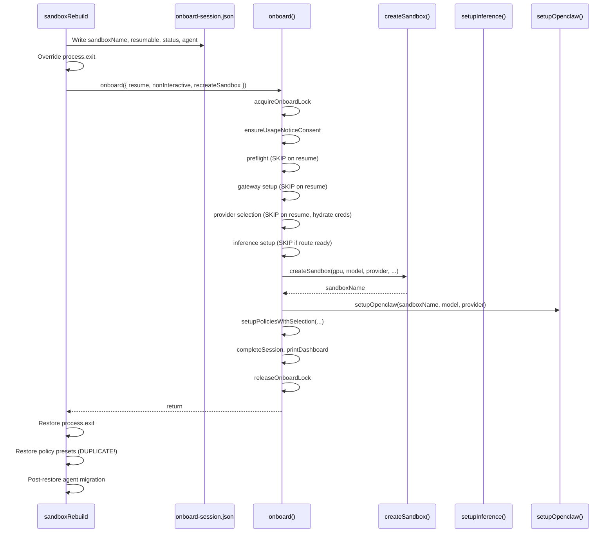
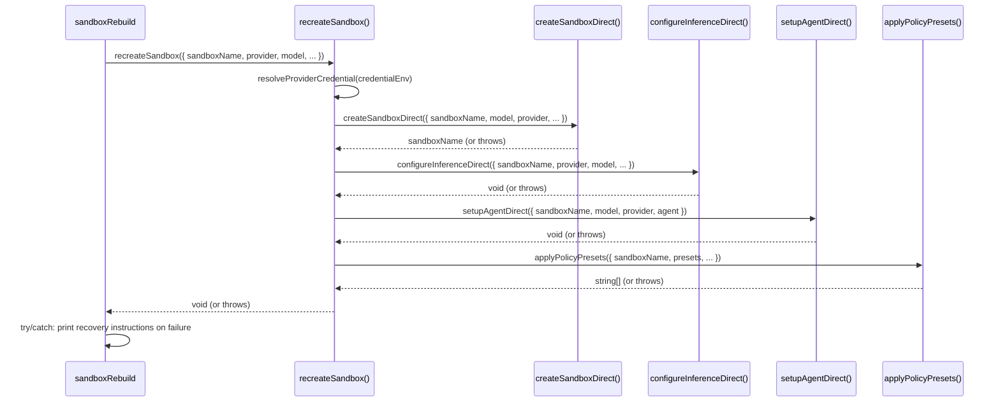

# Extract Rebuild Recreate Path & Canonicalize Credential Resolution

**Issue:** [#2306](https://github.com/NVIDIA/NemoClaw/issues/2306)
**Branch:** `issue-2306-extract-rebuild-recreate-canonical-credentials`
**Worktree:** `/Users/jyaunches/Development/NemoClaw-working/issue-2306`

## Overview & Objectives

### Problem

`sandboxRebuild()` in `src/nemoclaw.ts` calls the monolithic `onboard()` function as a subroutine:

```typescript
await onboard({ resume: true, nonInteractive: true, recreateSandbox: true, agent: rebuildAgent });
```

`onboard()` is a 476-line orchestrator inside a 7,857-line file. It was designed as a standalone, user-facing CLI flow with its own lock management, session state machine (8 steps), 105 `process.exit()` calls, and preflight validation. Rebuild only needs 4 of those 8 steps — but it gets all the baggage.

The #2273 fix added a `process.exit` interceptor as a stopgap:

```typescript
const _savedExit = process.exit;
process.exit = ((code) => {
  onboardFailed = true;
  const err = new Error(`onboard exited with code ${code}`);
  err.name = "RebuildOnboardExit";
  throw err;
}) as typeof process.exit;
```

This is fragile: it skips `process.once("exit")` listeners, requires manual lock cleanup, and silently swallows real errors from unexpected code paths.

Separately, credential resolution has two competing patterns (`getCredential()` vs direct `process.env[key]`) with no structural guard against regression.

### Goal

1. Extract a focused `recreateSandbox()` function that does only what rebuild needs, accepts explicit parameters (no session file manipulation), and throws on error instead of calling `process.exit()`.
2. Introduce `resolveProviderCredential()` as the single canonical entry point for provider credential resolution, with a lint guard and parametric test to prevent regression.

### Non-Goals

- Refactoring `onboard()` itself (it continues to serve the interactive onboarding flow)
- Moving `onboard()` to a different module or splitting the 7,857-line file
- Changing the `onboard-session.json` schema
- Migrating to oclif command classes

## Current State Analysis

### Files to modify

| File | Current Role | Lines |
|---|---|---|
| `src/nemoclaw.ts` | Monolithic CLI: sandboxRebuild (lines 2480–2910), upgradeSandboxes (lines 2915–3022) | ~3,800 |
| `src/lib/onboard.ts` | Monolithic onboard flow: onboard (7237–7766), createSandbox (3800–4578), setupInference (5382–5610), setupOpenclaw (5892–5915), hydrateCredentialEnv (722–729) | 7,857 |
| `src/lib/credentials.ts` | Credential storage and retrieval: getCredential (95–100) | 353 |
| `eslint.config.mjs` | Flat ESLint config | ~140 |

### Files to create

| File | Purpose |
|---|---|
| `src/lib/sandbox-recreate.ts` | Focused recreate function with throw-based error handling |
| `src/lib/sandbox-recreate.test.ts` | Unit tests for sandbox-recreate |
| `test/canonical-credential-resolution.test.ts` | Parametric test for credential resolution |
| `eslint-rules/no-direct-credential-env.js` | Custom ESLint rule |
| `test/no-direct-credential-env.test.ts` | ESLint rule tests |

### Architecture: Current rebuild flow



**Problems visible in this flow:**
1. Session file manipulation is the communication channel between rebuild and onboard
2. process.exit override is the error handling mechanism
3. Policy presets are applied twice (once in onboard, once in rebuild's post-restore)
4. Lock management is unnecessary (rebuild controls its own flow)
5. Preflight, consent, gateway setup are unnecessary (all already running)

### Architecture: Proposed rebuild flow



**Improvements:**
1. No session file manipulation — explicit parameters
2. No process.exit override — throw-based errors with try/catch
3. No duplicate policy application — recreateSandbox handles it once
4. No unnecessary steps — no lock, preflight, consent, or gateway setup

### Credential resolution: Current state

Two patterns compete for resolving provider API keys:

```
┌─────────────────────────────────────────────────────────────────┐
│ Pattern A: getCredential(key)           [credentials.ts:95]     │
│   1. Check process.env[key]                                     │
│   2. Check ~/.nemoclaw/credentials.json                         │
│   Result: Returns from either source                            │
├─────────────────────────────────────────────────────────────────┤
│ Pattern B: process.env[key] directly    [onboard.ts:4793-4830]  │
│   1. Check process.env[key]                                     │
│   Result: Misses credentials.json entirely                      │
├─────────────────────────────────────────────────────────────────┤
│ Bridge: hydrateCredentialEnv(key)       [onboard.ts:722]        │
│   1. Calls getCredential(key)                                   │
│   2. Populates process.env[key] if found                        │
│   Result: Makes Pattern B work — but must be called first       │
└─────────────────────────────────────────────────────────────────┘
```

The #2273 fix added a `hydrateCredentialEnv()` call at line 4785 to bridge the gap, but the bridge must be manually inserted before each `process.env[key]` check. Nothing prevents a new provider from being added with only Pattern B.

### REMOTE_PROVIDER_CONFIG entries (6 remote providers)

| Key | credentialEnv | Provider |
|---|---|---|
| `build` | `NVIDIA_API_KEY` | NVIDIA Endpoints |
| `openai` | `OPENAI_API_KEY` | OpenAI |
| `anthropic` | `ANTHROPIC_API_KEY` | Anthropic |
| `anthropicCompatible` | `COMPATIBLE_ANTHROPIC_API_KEY` | Anthropic-compatible |
| `gemini` | `GEMINI_API_KEY` | Google Gemini |
| `custom` | `COMPATIBLE_API_KEY` | OpenAI-compatible |

All 6 must resolve credentials identically. The parametric test ensures this.

## Implementation Phases

## Phase 1: Canonical Credential Resolution [COMPLETED: 16ec7acc]

**Goal:** Introduce `resolveProviderCredential()` as the single canonical entry point for all provider credential resolution, replace the dual-pattern in onboard.ts, and add a parametric test that covers all 6 providers.

### Changes

**Modify `src/lib/credentials.ts`:**

- Add `resolveProviderCredential(envName: string): string | null`
  - Calls `getCredential(envName)` to resolve from env or credentials.json
  - If a value is found, also populates `process.env[envName]` (so downstream code that reads `process.env` directly sees the value)
  - Returns the resolved value or null
  - This replaces the need for callers to first call `hydrateCredentialEnv()` and then check `process.env`
- Export `resolveProviderCredential` from the module

**Modify `src/lib/onboard.ts`:**

- Update `hydrateCredentialEnv()` (line 722) to delegate to `resolveProviderCredential()`:
  ```typescript
  function hydrateCredentialEnv(envName: string | null | undefined): string | null {
    if (!envName) return null;
    return resolveProviderCredential(envName);
  }
  ```
  Keep `hydrateCredentialEnv` as a wrapper — it's exported (line 7847) and used in 3 places within onboard.ts (line 4785 in provider selection, line 5412 in setupInference, line 7479 on resume path). Changing the name at all call sites would cause unnecessary merge conflicts with open PRs.

- In the non-interactive provider selection path (lines 4787–4835), replace the pattern of `hydrateCredentialEnv(credentialEnv)` followed by `process.env[credentialEnv]` checks with `resolveProviderCredential(credentialEnv)`:

  For the `build` (NVIDIA) provider (lines 4787–4808):
  - Line 4785: `hydrateCredentialEnv(credentialEnv)` already called — keep as-is (it delegates to resolveProviderCredential now)
  - Line 4793–4799: Replace `if (!process.env.NVIDIA_API_KEY)` with `if (!resolveProviderCredential("NVIDIA_API_KEY"))` after also checking NEMOCLAW_PROVIDER_KEY fallback
  - Line 4800: `validateNvidiaApiKeyValue(process.env.NVIDIA_API_KEY)` → `validateNvidiaApiKeyValue(resolveProviderCredential("NVIDIA_API_KEY")!)` (non-null after the check)

  For all other remote providers (lines 4821–4842):
  - Line 4825: `if (_providerKeyHint && !process.env[credentialEnv])` → `if (_providerKeyHint && !resolveProviderCredential(credentialEnv))`
  - Line 4830: `if (!process.env[credentialEnv])` → `if (!resolveProviderCredential(credentialEnv))`

  **Note:** The `NEMOCLAW_PROVIDER_KEY` fallback (lines 4789–4791 and 4824–4826) writes directly to `process.env`. This is intentional — it's a user-facing override mechanism, not a credential resolution pattern. Leave it as-is.

**Create `test/canonical-credential-resolution.test.ts`:**

- Parametric test that iterates all 6 entries in `REMOTE_PROVIDER_CONFIG`
- For each entry:
  1. Create a temp HOME with `credentials.json` containing the credential
  2. Ensure `process.env` does NOT have the key
  3. Call `resolveProviderCredential(credentialEnv)`
  4. Verify it returns the saved value
  5. Verify `process.env[credentialEnv]` is now populated
- Additional test cases:
  - When credential exists in env but NOT in credentials.json → returns env value
  - When credential exists in both → env takes precedence (existing getCredential behavior)
  - When credential exists nowhere → returns null, process.env unchanged
  - Empty/whitespace values are normalized

### Acceptance Criteria

- [ ] `resolveProviderCredential()` is exported from `src/lib/credentials.ts`
- [ ] `hydrateCredentialEnv()` delegates to `resolveProviderCredential()` — no duplicate logic
- [ ] All 6 parametric test cases pass (one per REMOTE_PROVIDER_CONFIG entry)
- [ ] Edge case tests pass: env-only, file-only, both, missing, whitespace
- [ ] Non-interactive provider selection in onboard.ts uses `resolveProviderCredential()` (no bare `process.env[credentialEnv]` checks for credential presence)
- [ ] Existing tests pass: `npm test` in the worktree
- [ ] `npm run build:cli` compiles without errors

## Phase 2: Extract Composable Sandbox Primitives [COMPLETED: b8b12041]

**Goal:** Extract throw-based, composable functions from `onboard.ts` into a new `src/lib/sandbox-recreate.ts` module that performs the subset of operations rebuild needs: credential validation, sandbox creation, inference configuration, agent setup, and policy application.

### Design Decisions

**Why a new module instead of modifying onboard.ts?**
- `onboard.ts` is 7,857 lines and touched by 7 open PRs. Adding new functions to it increases merge conflict surface.
- The extracted functions have a fundamentally different error contract (throw vs. process.exit).
- A new module makes the dependency direction clear: `sandbox-recreate.ts` imports from `onboard.ts`, not the reverse.

**What can we import from onboard.ts vs. what must we reimplement?**

Functions we can import from `onboard.ts` re-exports (wrappers with `runOpenshell` already injected):
- `upsertProvider()` — creates/updates gateway providers (wrapper calls `onboard-providers.upsertProvider(..., runOpenshell)`)
- `providerExistsInGateway()` — checks if a provider exists (same injection pattern)
- `buildSandboxConfigSyncScript()` — generates the config sync script
- `writeSandboxConfigSyncFile()` — writes sync script to temp file
- `patchStagedDockerfile()` — patches Dockerfile with model/provider config
- `isSandboxReady()` / `parseSandboxStatus()` — sandbox readiness checks
- `isInferenceRouteReady()` — checks gateway inference routing
- `hashCredential()` — hashes credentials for registry storage
- `hydrateCredentialEnv()` — credential hydration (now delegates to resolveProviderCredential)
- `getSuggestedPolicyPresets()` — computes default policy presets
- `ensureOllamaAuthProxy()` — Ollama auth setup (from `onboard-ollama-proxy.ts`, re-exported)
- `runCaptureOpenshell()` — already exported from onboard.ts

Functions we can import directly from `onboard-providers.ts` (extracted by #2087/#2495):
- `REMOTE_PROVIDER_CONFIG` — the 6 remote provider configurations (exported from `onboard-providers.ts`, NOT re-exported from `onboard.ts`)
- `buildProviderArgs()` — builds openshell CLI args for provider operations
- `getSandboxInferenceConfig()` — resolves provider key, model ref, inference URL/API

Functions to newly export from onboard.ts (currently private):
- `runOpenshell()` — runs openshell CLI commands (wraps `run()` from runner.ts with openshell binary resolution). Needed by `sandbox-recreate.ts` for gateway select, inference set, and sandbox connect commands.
- `GATEWAY_NAME` — the gateway name constant

Functions that use `process.exit()` internally and need wrapping:
- `createSandbox()` — 13 `process.exit` calls. We wrap the underlying `streamSandboxCreate()` and `runOpenshell()` calls directly instead of calling `createSandbox()`.
- `setupInference()` — 13 `process.exit` calls. We compose `upsertProvider()` and `runOpenshell(["inference", "set", ...])` directly.

Functions that are clean (no process.exit):
- `setupOpenclaw()` — 0 `process.exit` calls. Can be imported and called, but it uses `step()` for console output which is unnecessary for rebuild.
- `handleAgentSetup()` in agent-onboard.ts — uses an `OnboardContext` parameter. We can construct a simplified context.

### Changes

**Create `src/lib/sandbox-recreate.ts`:**

Define the following types and functions:

```typescript
interface RecreateParams {
  sandboxName: string;
  provider: string;
  model: string;
  credentialEnv: string | null;
  endpointUrl: string | null;
  preferredInferenceApi: string | null;
  agent: string | null;  // agent name, not AgentDefinition
  fromDockerfile: string | null;
  webSearchConfig: { fetchEnabled: boolean } | null;
  messagingChannels: string[];
  policyPresets: string[];
  dangerouslySkipPermissions: boolean;
}

interface RecreateResult {
  sandboxName: string;
  appliedPresets: string[];
}
```

**`validateRecreateCredentials(credentialEnv: string | null): void`**
- If `credentialEnv` is null, return (local inference, no credential needed)
- Call `resolveProviderCredential(credentialEnv)`
- If null, throw `RecreateError` with code `"credential_missing"` and the env name
- This is a pure validation step — no side effects beyond hydrating process.env

**`createSandboxDirect(params): string`**
- Accepts explicit params: sandboxName, model, provider, preferredInferenceApi, webSearchConfig, messagingChannels, fromDockerfile, agent, dangerouslySkipPermissions
- Performs the subset of createSandbox that rebuild needs:
  1. Stage build context (from Dockerfile, agent build, or optimized default)
  2. Resolve base policy path
  3. Build the `openshell sandbox create` command with args
  4. Upsert messaging providers
  5. Patch the staged Dockerfile
  6. Run `streamSandboxCreate()`
  7. Wait for sandbox to become ready
  8. Set up dashboard forward
  9. Register sandbox in registry
- On any failure: throw `RecreateError` with descriptive message instead of process.exit
- Returns the sandbox name
- This function imports `streamSandboxCreate` from `sandbox-create-stream.ts`, `runOpenshell` from `onboard.ts`, and helpers from `onboard.ts`/`onboard-providers.ts`

**`configureInferenceDirect(params): void`**
- Accepts: sandboxName, provider, model, credentialEnv, endpointUrl
- Selects the gateway: `runOpenshell(["gateway", "select", GATEWAY_NAME])` (runOpenshell from onboard.ts, GATEWAY_NAME from onboard.ts)
- Resolves the remote provider config from `REMOTE_PROVIDER_CONFIG` (imported from `onboard-providers.ts`) or `getProviderSelectionConfig()`
- Calls `upsertProvider()` (imported from onboard.ts — the wrapper that injects runOpenshell)
- Runs `openshell inference set --provider <provider> --model <model>` (with `--no-verify` for skip-verify providers)
- On failure: throw `RecreateError` instead of process.exit

**`setupAgentDirect(params): void`**
- Accepts: sandboxName, model, provider, agent (AgentDefinition or null)
- If agent is null, loads default "openclaw" agent
- Runs `getProviderSelectionConfig()` and `buildSandboxConfigSyncScript()` to produce the config sync
- Pipes the sync script into the sandbox via `openshell sandbox connect`
- For non-openclaw agents: waits for health probe (same logic as `handleAgentSetup`)
- On failure: throw `RecreateError`

**`applyPolicyPresetsDirect(params): string[]`**
- Accepts: sandboxName, presets (string[]), webSearchConfig, messagingChannels, provider, dangerouslySkipPermissions
- If dangerouslySkipPermissions: call `shields.shieldsDownPermanent()` and return `[]`
- Wait for sandbox ready
- If presets are provided: apply them via `policies.applyPreset()` (same logic as rebuild's existing preset restore at nemoclaw.ts lines 2830–2863)
- If no presets: compute suggestions via `getSuggestedPolicyPresets()` and apply those
- Returns the list of applied presets
- On failure: throw `RecreateError`

**`recreateSandbox(params: RecreateParams): Promise<RecreateResult>`**
- Orchestrates the above functions in order:
  1. `validateRecreateCredentials(params.credentialEnv)`
  2. `createSandboxDirect(...)` — wraps in try/catch, throws RecreateError
  3. `configureInferenceDirect(...)` — wraps in try/catch
  4. `setupAgentDirect(...)` — wraps in try/catch
  5. `applyPolicyPresetsDirect(...)` — wraps in try/catch
- No session file reads or writes
- No lock management
- No console step numbers (rebuild has its own logging)
- Returns `{ sandboxName, appliedPresets }`

**Define `RecreateError`:**
```typescript
class RecreateError extends Error {
  code: "credential_missing" | "sandbox_create_failed" | "inference_failed" | "agent_setup_failed" | "policy_failed";
  constructor(message: string, code: RecreateError["code"]) {
    super(message);
    this.name = "RecreateError";
    this.code = code;
  }
}
```

### What NOT to extract

- `stageOptimizedSandboxBuildContext()` — already a standalone function in onboard.ts, can be imported
- `streamSandboxCreate()` — lives in sandbox-create-stream.ts, import as-is
- Policy application logic — use the existing `policies.applyPreset()` from policies.ts directly
- Agent build context — use `agentOnboard.createAgentSandbox()` directly

### Acceptance Criteria

- [ ] `src/lib/sandbox-recreate.ts` exists and exports `recreateSandbox`, `RecreateError`, and all sub-functions
- [ ] No `process.exit()` calls in sandbox-recreate.ts — all errors throw `RecreateError`
- [ ] `recreateSandbox()` accepts explicit `RecreateParams` — no session file reads
- [ ] Each sub-function can be called independently (composable)
- [ ] `RecreateError.code` allows callers to distinguish failure types
- [ ] Unit tests in `src/lib/sandbox-recreate.test.ts` cover:
  - Happy path with mocked openshell calls
  - Credential validation failure → throws with code `"credential_missing"`
  - Sandbox creation failure → throws with code `"sandbox_create_failed"`
  - Inference configuration failure → throws with code `"inference_failed"`
  - Agent setup failure → throws with code `"agent_setup_failed"`
  - Policy application failure → throws with code `"policy_failed"`
- [ ] `npm run build:cli` compiles the new module
- [ ] `npm test` passes

## Phase 3: Rewire sandboxRebuild [COMPLETED: 6d4c4fd2]

**Goal:** Replace the `onboard()` call and `process.exit` interceptor in `sandboxRebuild()` with a clean `recreateSandbox()` call in try/catch. Also fix the duplicate policy application.

### Changes

**Modify `src/nemoclaw.ts` — sandboxRebuild() (lines 2480–2910):**

Add import at top of file:
```typescript
const { recreateSandbox, RecreateError } = require("./lib/sandbox-recreate");
```

**Remove** the following blocks:

1. **Session manipulation** (lines 2696–2721):
   ```typescript
   // REMOVE: onboardSession.updateSession((s) => { s.sandboxName = ...; s.resumable = true; ... })
   // REMOVE: process.env.NEMOCLAW_SANDBOX_NAME = sandboxName;
   ```
   Rebuild no longer communicates with onboard through the session file.

2. **process.exit interceptor** (lines 2731–2774):
   ```typescript
   // REMOVE: const _savedExit = process.exit;
   // REMOVE: process.exit = ((code) => { ... }) as typeof process.exit;
   ```

3. **onboard() call** (lines 2756–2774):
   ```typescript
   // REMOVE: const { onboard } = require("./lib/onboard");
   // REMOVE: await onboard({ resume: true, nonInteractive: true, ... });
   ```

4. **Manual cleanup after onboard failure** (lines 2776–2794):
   ```typescript
   // REMOVE: onboardSession.releaseOnboardLock();
   // REMOVE: onboardSession.markStepFailed(...);
   ```

5. **Rebuild's own policy preset restoration** (lines 2830–2863):
   The duplicate policy application. `recreateSandbox()` now handles policies.

**Replace with:**

```typescript
// Step 4: Recreate sandbox
console.log("");
console.log("  Creating new sandbox with current image...");

const session = onboardSession.loadSession();

try {
  const result = await recreateSandbox({
    sandboxName,
    provider: session?.provider || "nvidia-prod",
    model: session?.model || "nvidia/nemotron-3-super-120b-a12b",
    credentialEnv: rebuildCredentialEnv,
    endpointUrl: session?.endpointUrl || null,
    preferredInferenceApi: session?.preferredInferenceApi || null,
    agent: rebuildAgent,
    fromDockerfile: storedFromDockerfile,
    webSearchConfig: session?.webSearchConfig || null,
    messagingChannels: session?.messagingChannels || [],
    policyPresets: backup.manifest.policyPresets || [],
    dangerouslySkipPermissions: sb.dangerouslySkipPermissions || false,
  });
} catch (err) {
  const message = err instanceof Error ? err.message : String(err);
  const code = err instanceof RecreateError ? err.code : "unknown";

  console.error("");
  console.error(`  ${_RD}Recreate failed after sandbox was destroyed.${R}`);
  console.error(`  Failure: ${message}`);
  console.error(`  Backup is preserved at: ${backup.manifest.backupPath}`);
  console.error("");
  console.error("  To recover manually:");
  console.error(`    1. Fix the issue above (missing credential, Docker problem, etc.)`);
  console.error(`    2. Run: nemoclaw onboard --resume`);
  console.error(`       This will recreate sandbox '${sandboxName}'.`);
  console.error(`    3. Then restore your workspace state:`);
  console.error(`       nemoclaw ${sandboxName} snapshot restore "${backup.manifest.timestamp}"`);
  console.error("");
  bail(
    `Recreate failed (sandbox destroyed). Backup: ${backup.manifest.backupPath}`,
    1,
  );
  return;
}
```

**Keep** the following blocks unchanged:

- Steps 1–3 (backup, delete sandbox) — these remain as-is
- Step 5 (state restore, lines 2814–2828) — remains, but now runs after recreateSandbox instead of after onboard
- Step 6 (post-restore agent migration, lines 2865–2891) — remains
- Step 7 (registry version update, lines 2892–2896) — remains
- Step 8 (final output, lines 2898–2909) — remains

**Remove the `storedFromDockerfile` derivation** from the session (lines 2726–2728) and instead get it from the session directly in the RecreateParams.

**Verify `upgradeSandboxes()`** (lines 2915–3022): This function calls `sandboxRebuild()` with `{ throwOnError: true }`. Since we're replacing the onboard call inside sandboxRebuild, upgradeSandboxes benefits automatically. No changes needed to upgradeSandboxes itself.

### Acceptance Criteria

- [ ] `sandboxRebuild()` no longer calls `onboard()` — it calls `recreateSandbox()`
- [ ] No `process.exit` interceptor in sandboxRebuild — removed entirely
- [ ] No session file manipulation in sandboxRebuild before the recreate call — removed entirely
- [ ] Policy presets are applied exactly once (inside recreateSandbox, not duplicated in rebuild's post-restore)
- [ ] On recreate failure: error message, backup path, and recovery instructions are printed
- [ ] On recreate failure with `throwOnError`: error propagates to upgradeSandboxes
- [ ] `upgradeSandboxes --auto` still works for batch rebuilds
- [ ] Existing rebuild credential preflight (Step 0) is unchanged — it still aborts before destroying if credential is missing
- [ ] State restore (Step 5) still runs after successful recreate
- [ ] Post-restore agent migration (openclaw doctor --fix) still runs
- [ ] Registry version update still runs
- [ ] Update `test/rebuild-credential-preflight.test.ts`:
  - Remove/update tests that verify process.exit interception behavior
  - Add test: recreateSandbox throws RecreateError → recovery instructions printed
  - Add test: recreateSandbox throws → bail() called with throwOnError propagation
- [ ] `npm test` passes
- [ ] `npm run build:cli` compiles without errors

## Phase 4: ESLint Guard Rule

**Goal:** Add a custom ESLint rule that flags direct `process.env` access for known provider credential keys in `onboard.ts`, preventing regression of the dual-pattern credential bug.

### Changes

**Create `eslint-rules/no-direct-credential-env.js`:**

Custom ESLint rule that reports on two patterns:

1. **Static property access:** `process.env.NVIDIA_API_KEY`, `process.env.OPENAI_API_KEY`, `process.env.ANTHROPIC_API_KEY`, `process.env.GEMINI_API_KEY`, `process.env.COMPATIBLE_API_KEY`, `process.env.COMPATIBLE_ANTHROPIC_API_KEY`

2. **Dynamic property access:** `process.env[credentialEnv]` where the variable name contains "credential" (case-insensitive). This catches the pattern at lines 4825 and 4830 of onboard.ts.

The rule:
- Only flags accesses in `src/lib/onboard.ts` (configurable via rule options)
- Does NOT flag:
  - `src/lib/credentials.ts` (where `process.env[key]` is the intended implementation)
  - Test files (`test/` directory)
  - The `NEMOCLAW_PROVIDER_KEY` fallback writes (these are user-facing overrides, not credential resolution)
  - Assignment targets (`process.env[key] = value` is setting, not resolving)
- Suggests `resolveProviderCredential()` or `getCredential()` as alternatives
- Rule name: `nemoclaw/no-direct-credential-env`

**Modify `eslint.config.mjs`:**

Add a new config block for `src/lib/onboard.ts` that enables the custom rule:

```javascript
{
  files: ["src/lib/onboard.ts"],
  plugins: {
    nemoclaw: { rules: { "no-direct-credential-env": require("./eslint-rules/no-direct-credential-env") } },
  },
  rules: {
    "nemoclaw/no-direct-credential-env": "error",
  },
},
```

**Create `test/no-direct-credential-env.test.ts`:**

Test the ESLint rule using `@eslint/rule-tester` (or vitest with the rule's `create` function):

Valid patterns (should NOT report):
- `getCredential("NVIDIA_API_KEY")` — correct pattern
- `resolveProviderCredential("NVIDIA_API_KEY")` — correct pattern
- `process.env.NVIDIA_API_KEY = value` — assignment, not resolution
- `process.env.SOME_OTHER_VAR` — not a credential key
- `process.env[credentialEnv]` in credentials.ts — excluded file

Invalid patterns (SHOULD report):
- `process.env.NVIDIA_API_KEY` (read context)
- `process.env.OPENAI_API_KEY` (read context)
- `process.env[credentialEnv]` (dynamic read in onboard.ts)
- `if (!process.env.ANTHROPIC_API_KEY)` (conditional check)

### Acceptance Criteria

- [ ] `eslint-rules/no-direct-credential-env.js` exists and is a valid ESLint rule
- [ ] Rule flags all 6 known credential env names when accessed directly in read context
- [ ] Rule flags dynamic `process.env[credentialEnv]` pattern
- [ ] Rule does NOT flag credentials.ts or test files
- [ ] Rule does NOT flag assignment targets (write context)
- [ ] `eslint.config.mjs` registers the rule for `src/lib/onboard.ts`
- [ ] Running `npx eslint src/lib/onboard.ts` passes with no violations (because Phase 1 already fixed the patterns)
- [ ] Rule tester tests pass in `test/no-direct-credential-env.test.ts`
- [ ] `npm test` passes

## Phase 5: Clean the House

**Goal:** Remove dead code, update documentation, and resolve any TODOs left from the implementation.

### Changes

**Remove dead code from `src/nemoclaw.ts`:**

- Remove the `#2306` comment at line 2741 that references the process.exit interceptor as a known hack — the hack is gone
- Remove any `// TODO: #2306` comments added during implementation
- Verify no unused imports remain after removing the `require("./lib/onboard")` for onboard in sandboxRebuild

**Remove dead code from `src/lib/onboard.ts`:**

- If `hydrateCredentialEnv` is no longer called by external consumers (check nemoclaw.ts imports), consider removing it from the exports list. However, it's still used internally in onboard.ts (resume path line 7479, setupInference line 5412), so keep it.
- Remove any `// See #2273` / `// See #2306` comments that reference the old process.exit interception pattern as the current approach

**Update test/rebuild-credential-preflight.test.ts:**

- Remove tests that assert process.exit interception behavior (these tested the old stopgap)
- Ensure all remaining tests reflect the new recreateSandbox-based flow

**Verify documentation alignment:**

- The issue #2306 body references `onboard()` being called from rebuild. Verify the issue can be closed by checking all acceptance criteria.
- No user-facing documentation changes needed (rebuild's external behavior is unchanged — same CLI flags, same output messages)

**Verify related consumers:**

- `upgradeSandboxes()` calls `sandboxRebuild()` — verify it still works with `throwOnError: true`
- `sandboxDestroy()` and `sandboxStatus()` in nemoclaw.ts — unrelated, no changes needed
- E2E tests that exercise rebuild — verify they still pass (this is Phase 6 in the development plan, handled by running on sparky)

### Acceptance Criteria

- [ ] No `// TODO: #2306` comments remain in the codebase
- [ ] No dead imports in nemoclaw.ts from the removed onboard require
- [ ] `test/rebuild-credential-preflight.test.ts` has no tests asserting process.exit interception
- [ ] `npm test` passes
- [ ] `npm run build:cli` compiles cleanly
- [ ] `npx eslint .` passes with no new warnings
- [ ] `git diff --stat` shows a clean set of changes (no accidentally modified files)
